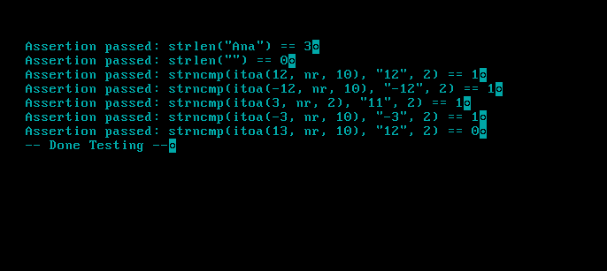

# **LearningOS**

LearningOS is an educational project aimed at understanding and building a basic operating system from scratch. It is a minimal OS designed for developers who want to explore the fundamentals of operating systems, including bootloading, memory management, and hardware interaction, in a hands-on manner.

# **Running Tests**


## **Project Structure**

```bash
.
├── boot                  # Bootloader-related code
│   └── boot.s            # Assembly code for booting the kernel
├── build                 # Build artifacts (generated during compilation)
│   ├── iso
│   └── obj
├── config                # Configuration files
│   ├── grub.cfg          # GRUB configuration for booting the kernel
│   └── linker.ld         # Linker script for kernel binary
├── drivers               # Hardware drivers (keyboard, screen, etc.)
├── kernel                # Kernel core functionality
│   ├── kernel.c          # Main kernel entry point
│   ├── panic.c           # Panic function for halting the system on critical failure
│   ├── tty.c             # Terminal (TTY) implementation
│   ├── utils.h           # Utility functions
│   └── vga.h             # VGA text-mode manipulation
├── libs                  # Standard library functions
│   └── libc
│       ├── assert.h      # Custom assertion handler for the kernel
│       ├── stdlib.c      # Standard C library functionality (itoa, atoi, etc.)
│       ├── string.c      # String manipulation functions (strlen, strcpy, etc.)
├── scripts               # Helper scripts for running the OS in an emulator
│   ├── run_qemu.sh       # Script for running QEMU with the kernel ISO
│   └── run_qemu_directly.sh  # Direct boot script for QEMU without ISO
└── tests                 # Test cases for kernel functions
    └── test_string.h     # Unit tests for string functions
```

## **Key Features**

- [x] **Bootloader**: A custom bootloader written in assembly to load the kernel.
- [ ] **Kernel**: A basic kernel implemented in C with features like memory management and hardware drivers.
- [ ] **Hardware Drivers**: Includes simple drivers for keyboard input and screen output.
- [ ] **Memory Management**: Initial memory management features, with plans to expand as the OS evolves.
- [ ] **Cross-Platform Build**: Uses `qemu` for easy testing and debugging without real hardware.

## **Getting Started**

### **Prerequisites**

Before you begin, ensure you have the following tools installed:

- **GCC Cross-Compiler** (`i686-elf-gcc`)
- **QEMU** (for emulating the OS)
- **GNU Make**
- **NASM** (for assembling the bootloader)

### **Building the OS**

1. Clone the repository:

   ```bash
   git clone https://github.com/yourusername/LearningOS.git
   cd LearningOS
   ```

2. Build the OS by running:

   ```bash
   make
   ```

This will generate the OS binary and a bootable ISO image in the `build/` directory.

### **Running the OS in QEMU**

You can run the OS using `qemu-system-i386` for easy emulation.

- **With GRUB**:

   ```bash
   ./scripts/run_qemu.sh
   ```

- **Directly (without GRUB)**:

   ```bash
   ./scripts/run_qemu_directly.sh
   ```

This will start the OS in QEMU, allowing you to interact with it through a terminal window.

## **Contributing**

Contributions are welcome! If you would like to contribute to the project, please fork the repository and submit a pull request. Feel free to open issues for any bugs or suggestions for improvements.

### **Steps to Contribute**

1. Fork this repository.
2. Create a new branch (`git checkout -b feature-branch`).
3. Make your changes.
4. Commit your changes (`git commit -m 'Add some feature'`).
5. Push to the branch (`git push origin feature-branch`).
6. Open a pull request.

## **Learning Resources**

This project is designed to be a learning experience. If you're new to operating system development, here are some resources that may help:

- **OSDev Wiki**: [https://wiki.osdev.org](https://wiki.osdev.org)

